# 🔥 Firebase Hosting - Guía de Deployment

## 📋 Tabla de Contenidos
1. [Pre-requisitos](#pre-requisitos)
2. [Configuración Inicial](#configuración-inicial)
3. [Deployment para Pruebas](#deployment-para-pruebas)
4. [Deployment a Producción](#deployment-a-producción)
5. [Seguridad Implementada](#seguridad-implementada)
6. [Comandos Útiles](#comandos-útiles)
7. [Troubleshooting](#troubleshooting)

---

## 📦 Pre-requisitos

### 1. Instalar Firebase CLI
```bash
# Instalar globalmente
npm install -g firebase-tools

# Verificar instalación
firebase --version
```

### 2. Crear Proyecto en Firebase Console
1. Ve a [Firebase Console](https://console.firebase.google.com)
2. Click en "Crear proyecto"
3. Nombre: `cloution-website`
4. Desactiva Google Analytics por ahora (opcional)
5. Crear proyecto

### 3. Configurar Authentication
```bash
# Login en Firebase
npm run firebase:login

# O directamente
firebase login
```

---

## 🚀 Configuración Inicial

### 1. Inicializar Firebase en el Proyecto
```bash
# El proyecto ya tiene firebase.json configurado, pero si necesitas reinicializar:
firebase init hosting

# Selecciona:
# - Use an existing project
# - cloution-website
# - Public directory: dist
# - Single-page app: Yes
# - Set up automatic builds: No (por ahora)
```

### 2. Configurar Múltiples Entornos
El proyecto ya está configurado con 3 entornos en `.firebaserc`:

```json
{
  "projects": {
    "default": "cloution-website",        // Desarrollo
    "staging": "cloution-website-staging", // Staging
    "production": "cloution-website-prod"  // Producción
  }
}
```

**IMPORTANTE**: Debes crear estos proyectos en Firebase Console:
1. `cloution-website` (desarrollo)
2. `cloution-website-staging` (para el equipo)
3. `cloution-website-prod` (producción final)

---

## 🧪 Deployment para Pruebas (Equipo)

### Opción 1: Deploy a Staging
```bash
# Build y deploy a staging
npm run deploy:staging

# URL resultante: https://cloution-website-staging.web.app
```

### Opción 2: Preview Channel (Recomendado para pruebas)
```bash
# Crear un preview temporal (7 días)
npm run deploy:preview

# Esto generará una URL única como:
# https://cloution-website--preview-abc123.web.app
```

### Opción 3: Emulador Local
```bash
# Probar localmente con Firebase
npm run build
npm run firebase:emulators

# Abre: http://localhost:5000
```

---

## 🏁 Deployment a Producción

### Proceso Completo:
```bash
# 1. Asegúrate de estar en la rama main
git checkout main
git pull origin main

# 2. Build de producción
npm run build

# 3. Preview local
npm run preview
# Verifica en http://localhost:4173

# 4. Deploy a producción
npm run deploy:production

# URL final: https://cloution-website-prod.web.app
# O tu dominio personalizado
```

---

## 🔐 Seguridad Implementada

### 1. Headers de Seguridad (firebase.json)
✅ **X-Content-Type-Options**: nosniff  
✅ **X-Frame-Options**: DENY  
✅ **X-XSS-Protection**: 1; mode=block  
✅ **Referrer-Policy**: strict-origin-when-cross-origin  
✅ **Permissions-Policy**: Desactiva cámara, micrófono, geolocalización  
✅ **HSTS**: Strict-Transport-Security configurado  

### 2. Protección de Formularios
✅ **Rate Limiting**: 3 intentos por minuto  
✅ **Validación de Email**: Regex estricto  
✅ **Sanitización de Inputs**: Previene XSS  
✅ **Detección de SQL Injection**: Patrones bloqueados  

### 3. Cache Strategy
- **JS/CSS**: Cache inmutable (1 año)
- **Imágenes**: Cache 24h con s-maxage 1 año
- **HTML**: Sin cache (siempre fresco)

---

## 💻 Comandos Útiles

### Desarrollo
```bash
# Desarrollo local
npm run dev

# Build local
npm run build

# Preview del build
npm run preview
```

### Firebase
```bash
# Login/Logout
firebase login
firebase logout

# Ver proyectos
firebase projects:list

# Cambiar proyecto activo
firebase use staging
firebase use production

# Ver hosting activo
firebase hosting:sites
```

### Deployment
```bash
# Deploy a staging (equipo)
npm run deploy:staging

# Deploy preview temporal
npm run deploy:preview

# Deploy a producción
npm run deploy:production

# Ver historial de deploys
firebase hosting:releases:list
```

### Rollback
```bash
# Ver releases anteriores
firebase hosting:releases:list

# Rollback a versión anterior
firebase hosting:rollback
```

---

## 📱 Configurar Dominio Personalizado

1. En Firebase Console → Hosting → Agregar dominio personalizado
2. Agregar: `cloution.com` y `www.cloution.com`
3. Verificar propiedad (archivo o DNS)
4. Configurar DNS:
   ```
   Type: A
   Host: @
   Value: [IPs de Firebase]
   
   Type: CNAME
   Host: www
   Value: cloution-website-prod.web.app
   ```

---

## 🔍 Monitoreo

### Firebase Console
- **Hosting**: Ver tráfico y uso
- **Performance**: Métricas de rendimiento
- **Analytics**: Comportamiento de usuarios

### Comandos de Verificación
```bash
# Ver estado del hosting
firebase hosting:channel:list

# Ver uso del proyecto
firebase projects:get cloution-website
```

---

## 🐛 Troubleshooting

### Error: "Permission denied"
```bash
# Re-autenticar
firebase login --reauth

# Verificar permisos en Console
# IAM → Agregar tu email con rol "Editor"
```

### Error: "Build failed"
```bash
# Limpiar y reconstruir
npm run clean
npm install
npm run build
```

### Error: "404 en rutas"
Verifica que `firebase.json` tenga:
```json
"rewrites": [
  {
    "source": "**",
    "destination": "/index.html"
  }
]
```

### Preview no funciona
```bash
# Crear nuevo preview channel
firebase hosting:channel:create test-channel
firebase hosting:channel:deploy test-channel
```

---

## 📊 Checklist Pre-Deployment

### Para Staging/Testing:
- [ ] Código en rama `develop` o `feature/*`
- [ ] Build local exitoso
- [ ] Sin errores en consola
- [ ] Formularios funcionando
- [ ] Responsive verificado

### Para Producción:
- [ ] Código en rama `main`
- [ ] Todos los PR mergeados
- [ ] Variables de entorno configuradas
- [ ] Sin console.log() de debug
- [ ] Performance > 90 en Lighthouse
- [ ] SEO meta tags actualizados
- [ ] Backup del deployment anterior
- [ ] Analytics configurado

---

## 🎯 URLs del Proyecto

### Desarrollo Local
- **Vite Dev**: http://localhost:5173
- **Firebase Emulator**: http://localhost:5000
- **Preview Build**: http://localhost:4173

### Firebase Hosting
- **Staging**: https://cloution-website-staging.web.app
- **Production**: https://cloution-website-prod.web.app
- **Preview**: https://cloution-website--preview-[ID].web.app

### Dominio Final
- **Principal**: https://cloution.com
- **WWW**: https://www.cloution.com

---

## 🚦 Flujo de Trabajo Recomendado

```mermaid
graph LR
    A[Desarrollo Local] --> B[Commit a Git]
    B --> C[Deploy Preview]
    C --> D[Revisión Equipo]
    D --> E{Aprobado?}
    E -->|Sí| F[Deploy Staging]
    E -->|No| A
    F --> G[Testing QA]
    G --> H{Pasa QA?}
    H -->|Sí| I[Deploy Production]
    H -->|No| A
```



---

## 🆘 Soporte

### Recursos
- [Firebase Documentation](https://firebase.google.com/docs/hosting)
- [Firebase Status](https://status.firebase.google.com)
- [Firebase Support](https://firebase.google.com/support)

### Comandos de Emergencia
```bash
# Rollback inmediato
firebase hosting:rollback

# Desactivar sitio (emergencia)
firebase hosting:disable

# Logs de deployment
firebase functions:log
```

---

**Última actualización**: Diciembre 2024  
**Versión**: 1.0.0  
**Estado**: ✅ Listo para deployment
