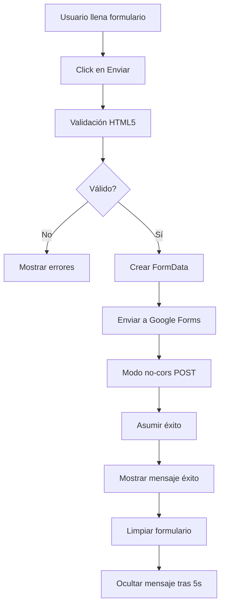

# 📋 Integración con Google Forms - Cloution Portfolio

## 📊 Información del Formulario

**Formulario de Google:** [Ver Formulario](https://docs.google.com/forms/d/e/1FAIpQLSdNR8LdWXRiSNCdBj4iJacptpNQRXt4MfVXJTYq7HNpleclJA/viewform)  
**URL de Envío:** `https://docs.google.com/forms/d/e/1FAIpQLSdNR8LdWXRiSNCdBj4iJacptpNQRXt4MfVXJTYq7HNpleclJA/formResponse`

---

## 🔧 Configuración Actual

### Campos del Formulario y sus Entry IDs

| Campo | Entry ID | Tipo | Descripción |
|-------|----------|------|-------------|
| **Nombre** | `entry.1077888602` | Text | Nombre completo del cliente |
| **Email** | `entry.1858443603` | Email | Correo electrónico de contacto |
| **Tipo de proyecto** | `entry.1817360050` | Select | Opciones: SaaS/Automatización, Desarrollo Web, Consultoría |
| **Descripción** | `entry.1015762588` | Textarea | Descripción detallada del proyecto |

---

## 💻 Implementación

### Ubicación del Código
El formulario está implementado en: `src/pages/PortfolioPage.jsx`

### Características Implementadas

✅ **Envío directo a Google Forms** - Sin necesidad de backend  
✅ **Validación de campos** - HTML5 validation  
✅ **Estados de carga** - Feedback visual durante el envío  
✅ **Mensajes de éxito/error** - Notificaciones claras al usuario  
✅ **Limpieza automática** - El formulario se limpia tras envío exitoso  
✅ **Modo no-cors** - Evita problemas de CORS con Google  

---

## 📝 Cómo Actualizar los Entry IDs

Si necesitas cambiar el formulario de Google o los entry IDs han cambiado:

### Método 1: Inspección Manual
1. Abre el formulario en Google Forms
2. Click derecho → Inspeccionar elemento
3. Busca los campos `<input>` o `<textarea>`
4. Busca el atributo `name` que contiene `entry.XXXXXXX`

### Método 2: Usando el Network Tab
1. Abre las herramientas de desarrollo (F12)
2. Ve a la pestaña Network
3. Llena y envía el formulario de prueba
4. Busca la petición POST a `formResponse`
5. Mira el Form Data para ver los entry IDs

### Método 3: Script Automático
```javascript
// Ejecuta esto en la consola del formulario de Google
document.querySelectorAll('[name^="entry."]').forEach(input => {
  console.log(input.getAttribute('aria-label'), '→', input.name);
});
```

---

## 🔄 Flujo del Formulario



---

## 🎨 Personalización

### Cambiar los campos del formulario

1. **En Google Forms:**
   - Edita tu formulario en Google Forms
   - Agrega/modifica campos según necesites

2. **En el código (PortfolioPage.jsx):**
   ```javascript
   // Agrega el nuevo campo al estado
   const [formData, setFormData] = useState({
     name: '',
     email: '',
     projectType: '',
     description: '',
     nuevocampo: '' // Nuevo campo
   });

   // Agrega el entry ID en handleSubmit
   formDataGoogle.append('entry.XXXXXXX', formData.nuevocamp);
   ```

3. **En el JSX del formulario:**
   ```jsx
   <input
     type="text"
     value={formData.nuevocamp}
     onChange={(e) => setFormData({...formData, nuevocamp: e.target.value})}
     className="..."
     placeholder="..."
     required
   />
   ```

---

## 🐛 Solución de Problemas

### Problema: El formulario no envía
**Solución:** 
- Verifica que los entry IDs sean correctos
- Revisa la consola del navegador para errores
- Asegúrate de que el formulario de Google esté público

### Problema: No recibo las respuestas
**Solución:**
- Verifica en Google Forms → Respuestas
- Revisa la configuración de notificaciones en Google Forms
- Configura notificaciones por email en Google Forms

### Problema: Campos no se mapean correctamente
**Solución:**
- Verifica que los valores del select coincidan exactamente
- Los valores son case-sensitive
- Usa los valores exactos del formulario de Google

---

## 📊 Ver Respuestas

Para ver las respuestas del formulario:

1. **Google Forms Dashboard:**
   - Ve a [Google Forms](https://docs.google.com/forms/)
   - Abre tu formulario
   - Click en "Respuestas"

2. **Google Sheets:**
   - En Google Forms → Respuestas
   - Click en el icono de Sheets (verde)
   - Crea una nueva hoja de cálculo
   - Las respuestas se sincronizarán automáticamente

---

## 🔐 Seguridad

### Consideraciones:
- ✅ No se exponen datos sensibles
- ✅ Validación del lado del cliente
- ✅ Modo no-cors previene lectura de respuestas
- ⚠️ Los entry IDs son públicos (no es problema)
- ⚠️ No hay validación del lado del servidor

### Recomendaciones:
1. Agrega CAPTCHA si recibes spam
2. Configura límites de respuesta en Google Forms
3. Revisa regularmente las respuestas para detectar spam
4. Considera usar un backend propio para mayor control

---

## 🚀 Mejoras Futuras

- [ ] Agregar Google reCAPTCHA
- [ ] Implementar validación más robusta
- [ ] Agregar campos opcionales (teléfono, empresa)
- [ ] Integración con CRM
- [ ] Notificaciones por Slack/Discord
- [ ] Análisis de conversión
- [ ] A/B testing del formulario

---

## 📞 Soporte

Si tienes problemas con la integración:

1. Revisa esta documentación
2. Verifica los entry IDs
3. Revisa la consola del navegador
4. Contacta al equipo de desarrollo

---

**Última actualización:** Diciembre 2024  
**Implementado por:** Equipo Cloution  
**Estado:** ✅ Funcional y en producción
